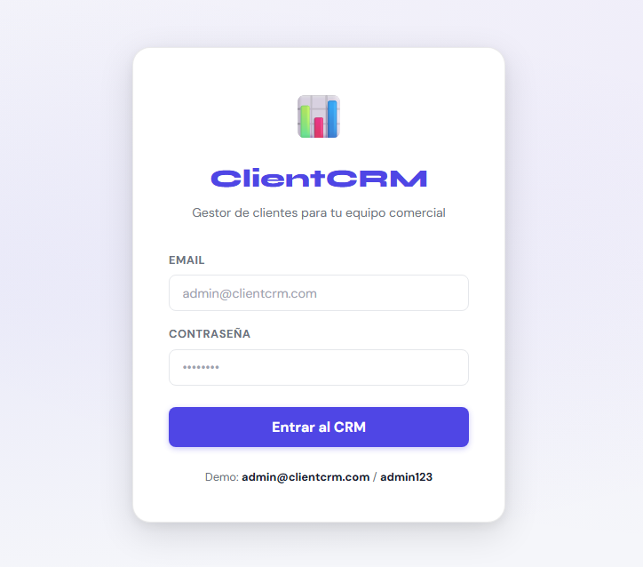
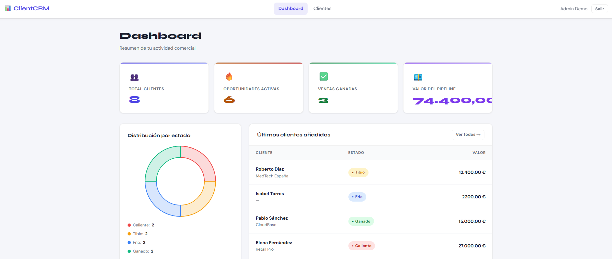
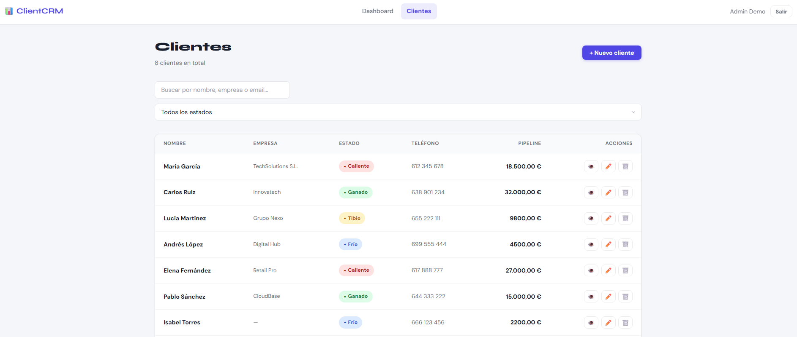
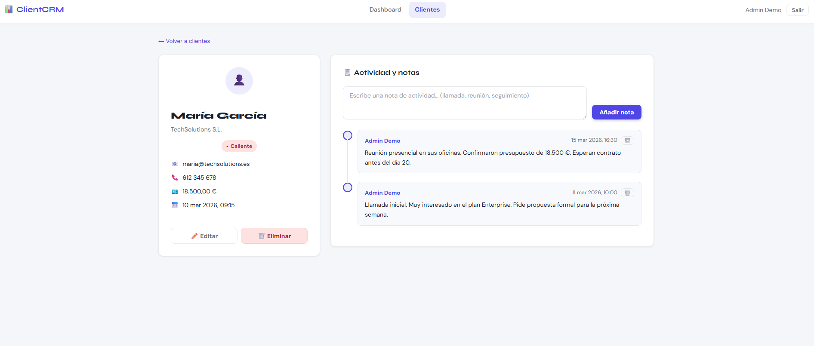

# 📊 ClientCRM — Gestor de Clientes Web

<div align="center">


**ClientCRM es una aplicación web full-stack para gestionar la cartera comercial de una empresa.**
Permite registrar clientes con sus datos de contacto, asignarles un estado de oportunidad
(caliente / tibio / frío / ganado) y registrar notas de actividad por cliente.
El dashboard ofrece métricas clave del pipeline en tiempo real sin recargar la página.

[📂 Ver repositorio](https://github.com/javips99/ClientCRM) · [🌐 Demo en vivo](https://javips99.github.io/ClientCRM/)

</div>

---

## 🔐 Acceso demo

| Campo | Valor |
|-------|-------|
| **Usuario** | admin@clientcrm.com |
| **Contraseña** | admin123 |

> Los datos son ficticios y se reinician al recargar la página.

---

## 📸 Capturas de pantalla

<div align="center">

| Login | Dashboard |
|:---:|:---:|
|  |  |

| Lista de clientes | Detalle del cliente |
|:---:|:---:|
|  |  |

</div>

---

## ✅ Funcionalidades implementadas

- [x] Autenticación segura con sesiones PHP y contraseñas `bcrypt`
- [x] Dashboard con 4 métricas del pipeline: total clientes, oportunidades activas, ventas ganadas y valor estimado
- [x] Gráfico de dona interactivo con distribución de clientes por estado (Chart.js)
- [x] CRUD completo de clientes con modal sin recarga de página (AJAX)
- [x] Filtrado de clientes por estado + búsqueda por nombre, empresa y email (debounce 350ms)
- [x] Vista de detalle del cliente con línea de tiempo de notas de actividad
- [x] Añadir / eliminar notas con **UI optimista** (respuesta visual instantánea)
- [x] Edición de cliente desde la vista de detalle
- [x] Notificaciones toast para feedback de todas las operaciones
- [x] Diseño responsive **mobile-first** con tema oscuro profesional
- [x] Caché de sesión en `sessionStorage` (evita peticiones en cada cambio de página)
- [x] Validación en servidor (PHP) y cliente (JS) en todos los formularios
- [x] Protección anti-XSS con `escapeHtml()` en todo el renderizado dinámico
- [x] Consultas preparadas (PDO) en todos los endpoints — cero riesgo de SQL injection
- [x] Suite de tests: 57 tests (Jest + PHPUnit) con 4 categorías
- [x] Seguridad: cookies `HttpOnly + SameSite=Strict`, headers Apache en `.htaccess`

---

## 🛠️ Requisitos previos

| Herramienta | Versión mínima |
|---|---|
| PHP | 8.1+ |
| MySQL | 8.0+ |
| Apache | 2.4+ (XAMPP recomendado) |
| Navegador moderno | Chrome 90 / Firefox 88 / Edge 90+ |
| Node.js *(solo tests JS)* | 18+ |
| Composer *(solo tests PHP)* | 2.x |

---

## 🚀 Instalación paso a paso

```bash
# 1. Clonar el repositorio
git clone https://github.com/javips99/ClientCRM.git

# 2. Mover la carpeta a htdocs de XAMPP
#    Windows: C:\xampp\htdocs\ClientCRM
#    macOS/Linux: /opt/lampp/htdocs/ClientCRM
```

**3. Crear la base de datos**

Abre phpMyAdmin (`http://localhost/phpmyadmin`) y ejecuta el archivo:

```
database/schema.sql
```

**4. Configurar credenciales de BD**

```bash
# Copiar la plantilla de configuración
cp api/config.example.php api/config.php
```

Editar `api/config.php` con tus credenciales MySQL:

```php
define('DB_HOST', 'localhost');
define('DB_NAME', 'clientcrm');
define('DB_USER', 'root');       // tu usuario
define('DB_PASS', '');           // tu contraseña
```

**5. Cargar datos de demo**

Visita en el navegador:

```
http://localhost/ClientCRM/setup.php
```

Esto crea el usuario admin y 8 clientes de ejemplo. **Elimina `setup.php` después.**

**6. Acceder a la aplicación**

```
http://localhost/ClientCRM/
```

| Campo | Valor |
|---|---|
| Email | `admin@clientcrm.com` |
| Contraseña | `admin123` |

---

## 📁 Estructura del proyecto

```
ClientCRM/
│
├── index.html                  # Login
├── dashboard.html              # Panel principal con métricas
├── clientes.html               # Lista de clientes + CRUD
├── cliente-detalle.html        # Ficha de cliente + notas
│
├── assets/
│   ├── css/
│   │   └── styles.css          # Estilos globales (dark theme, mobile-first)
│   └── js/
│       ├── utils.js            # Helpers compartidos (apiCall, escapeHtml, etc.)
│       ├── auth.js             # Login / logout / caché de sesión
│       ├── dashboard.js        # Métricas + Chart.js
│       ├── clientes.js         # CRUD + filtros + delegación de eventos
│       └── cliente-detalle.js  # Notas + edición + UI optimista
│
├── api/
│   ├── config.php              # Conexión PDO (en .gitignore)
│   ├── config.example.php      # Plantilla de configuración
│   ├── helpers.php             # requireAuth, getJsonInput, VALID_ESTADOS
│   ├── auth.php                # Endpoints: login / logout / check
│   ├── clientes.php            # CRUD: GET / POST / PUT / DELETE
│   ├── notas.php               # Notas: GET / POST / DELETE
│   └── dashboard.php           # Métricas agregadas
│
├── database/
│   └── schema.sql              # DDL: CREATE TABLE + índices + FK
│
├── tests/
│   ├── js/
│   │   ├── setup.js            # Configuración del entorno Jest
│   │   └── utils.test.js       # 33 tests JS (utils, apiCall, DOM)
│   └── php/
│       ├── bootstrap.php       # Stubs para PHPUnit
│       ├── ValidacionClienteTest.php  # 17 tests de validación
│       └── HelpersTest.php            # 7 tests de helpers PHP
│
├── package.json                # Dependencias Jest
├── composer.json               # Dependencias PHPUnit
├── phpunit.xml                 # Configuración PHPUnit
├── .htaccess                   # Security headers + protección Apache
└── .gitignore                  # Excluye config.php y setup.php
```

---

## 🔌 Variables de entorno / Configuración

Todas las variables se gestionan en `api/config.php` (no incluido en el repositorio).

| Constante | Descripción | Ejemplo | ¿Obligatoria? |
|---|---|---|---|
| `DB_HOST` | Host del servidor MySQL | `localhost` | ✅ Sí |
| `DB_NAME` | Nombre de la base de datos | `clientcrm` | ✅ Sí |
| `DB_USER` | Usuario de MySQL | `root` | ✅ Sí |
| `DB_PASS` | Contraseña de MySQL | `mipassword` | ✅ Sí |
| `DB_CHARSET` | Charset de la conexión | `utf8mb4` | ✅ Sí (defecto: utf8mb4) |

---

## 🧪 Ejecutar los tests

```bash
# Tests JavaScript (Jest)
npm install
npm test                     # ejecuta + genera reporte de cobertura

# Tests PHP (PHPUnit)
composer install
./vendor/bin/phpunit --colors=always
```

---

## 🏗️ Decisiones técnicas destacadas

| Decisión | Razón |
|---|---|
| **PHP + PDO** en lugar de MySQLi | API más limpia, soporte multi-driver, consultas preparadas nativas |
| **Sesiones PHP** en lugar de JWT | Sin dependencias externas, más seguro para apps monolíticas en servidor |
| **ENUM en MySQL** para `estado` | Integridad referencial garantizada en BD sin tabla de lookup adicional |
| **UI optimista** en notas | Respuesta visual instantánea mejora UX sin coste de arquitectura |
| **Caché `sessionStorage`** para auth | Elimina petición de red en cada cambio de página (-200ms de latencia) |
| **Delegación de eventos** en tabla | 1 listener vs N listeners — más eficiente con listas largas |

---

## 🔭 Posibles mejoras futuras

- [ ] Soporte multi-usuario con roles (admin / comercial)
- [ ] Importación masiva de clientes desde CSV
- [ ] Envío de emails de seguimiento directo desde la ficha del cliente
- [ ] Filtros avanzados por rango de fechas y valor del pipeline
- [ ] Exportación del pipeline a PDF / Excel
- [ ] API REST documentada con Swagger/OpenAPI
- [ ] Dockerización para despliegue reproducible

---

## 📄 Licencia

Distribuido bajo la licencia **MIT**. Consulta el archivo `LICENSE` para más detalles.

---

<div align="center">
  Desarrollado por <a href="https://github.com/javips99">@javips99</a> · 2026
</div>
